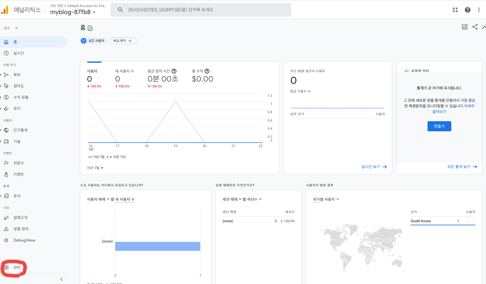
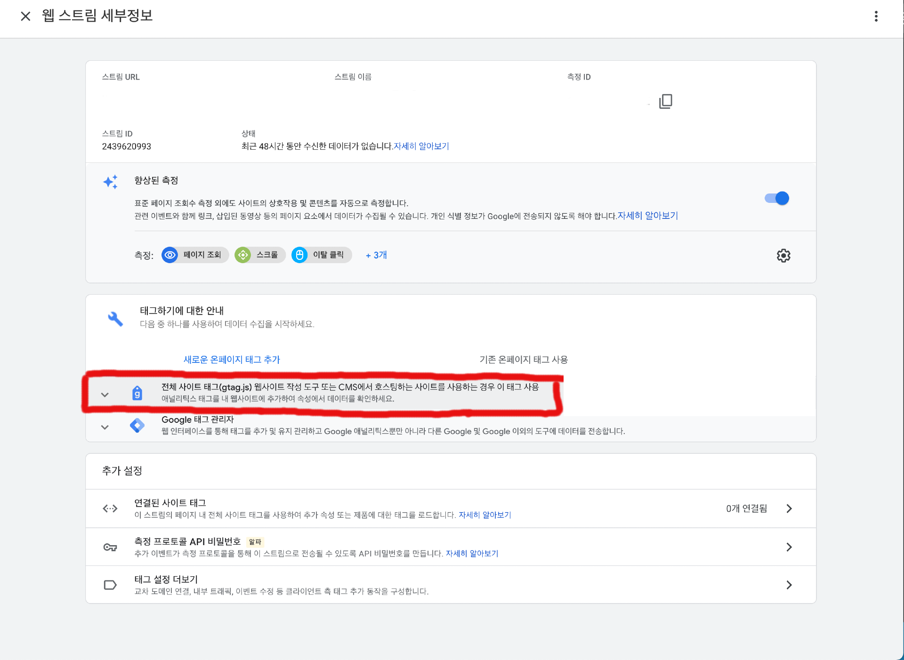

---

layout: post
type: tech
date: 2021-04-26 15:30
category: Blog
title: 올리브영 기술블로그에는 누가, 얼마나 방문했을까??
subtitle: Google Analytics(GA)를 활용한 웹 로그 분석
writer: 834836
post-header: true
header-img: img/title.png
hash-tag: [GA, Google Analytices, Weblog]

---

> 올-하! 💚 안녕하세요! 신입사원 <b>복스뮤직을 듣는 럭셔Lee</b>입니다. 오늘은 칼퇴요정님이 `Google Analytics`로 기술블로그에 대한 데이터 트래킹을 해보고 싶다고 하셔서 부랴부랴 준비하게 되었습니다. 올리브영 기술블로그를 만든지 얼마 되지 않았지만, 많은 분들이 기술블로그에 대해 관심을 가져주신 덕분이 아닐까 생각해봅니다 ^~^! 입사 후  처음으로 블로그에 글을 작성해보게 되어 마음이 벌써부터 두근두근거리는데 이 마음이 잘 전달되었으면 좋겠습니다 ㅎㅎ

 

#### 📖 목차

- [웹 데이터 로그 분석 툴 도입 배경](http://tech.oliveyoung.co.kr/tech/2104261530/#🎹-웹-데이터-로그-분석-툴-도입-배경)
- [근데 왜 하필 Google Analytics를 도입했을까?](http://tech.oliveyoung.co.kr/tech/2104261530/#🎧-근데-왜-하필-Google-Analytics-를-도입했을까?)
- [ Google Analytics 적용 프로세스](http://tech.oliveyoung.co.kr/tech/2104261530/#🎤-Google-Analytics-적용-프로세스)
- [Google Analytics 환경 구축이 빠른 이유](http://tech.oliveyoung.co.kr/tech/2104261530/#🔑-Google-Analytics-환경-구축이-빠른-이유)
- [그럼 반복적으로 사용하는 곳에 넣으면 되나?](http://tech.oliveyoung.co.kr/tech/2104261530/#🔊-그럼-반복적으로-사용하는-곳에-넣으면-되나?)
- [마치며](http://tech.oliveyoung.co.kr/tech/2104261530/#🛎-마치며)

 

### 🎹 웹 데이터 로그 분석 툴 도입 배경

수 많은 웹사이트는 물론이고 티스토리 등의 개인블로그를 하시는 분들도 얼마나 많은 사용자들이 들어오나 궁금해하며 트래킹 데이터를 제공해주는 서비스를 이용하고 있습니다. 그리고 이를 바탕으로 방문자 유형이나 방문자 수를 분석해 많은 인사이트를 뽑아내고 있습니다. 

최근에  올리브영 기술블로그에 대해 언급해주시는 분들이 많아졌습니다. 저희도, 웹사이트 트래킹을 통해 방문자 유형을 분석하여 기술블로그에 대한 방향성을 제고하고자 `웹 데이터 로그 분석 툴` 을 도입하였습니다. 벌써부터 얼마나 많은 분들이 방문해주시는지 궁금하네요!! (궁금따리 궁금따 신나는 노래~ 🎺)

 

### 🎧 근데 왜 하필 Google Analytics 를 도입했을까?

---------

시중에는 햄버거(🍔)에 들어가는 패티 마냥, 수 많은  `웹 데이터 로그 분석 툴`  이 있습니다.  대표적인 것들로는  `Google Analytics`, `Adobe Analytics`, `Web trends`, `AceCounter` 등이 있죠.

 

그럼 왜 `웹 데이터 로그 분석 툴` 중에서도  `Google Analytics`를 사용하게 되었을까요?? 🤹‍♀️ 

 

`Google Analytics`는 다음과 같은 장점을 갖고 있습니다.

- 압도적인 점유율
  - 전 세계 로그 분석 툴 중 70% 이상의 점유율을 차지하고 있습니다.
  - 이는 곧, `Google Analytics`가 로그 분석 툴의 대세라는 뜻이기도 합니다.
- 저렴한 서비스 비용
  - 웹사이트와 구글 계정만 있다면 저렴하게 이용할 수 있습니다.
- 체계적인 분석 시스템
  - 웹사이트를 방문하는 고객 데이터를 100가지가 넘는 보고서를 이용하여 제공하고 있습니다.
  - 사용자가 원하는 보고서를 직접 만들어 활용할 수 있습니다.
  - 세그먼트 시스템을 활용하여 데이터를 보다 정밀하게 분석할 수 있습니다.
  - 각종 유입 매체를 분석하고, 이벤트를 생성하여 상황에 맞게 데이터를 수집할 수 있습니다.
- 업데이트
  - 사용자가 원하는 분석 보고서들을 시대에 맞게 업데이트 해오고 있습니다.

 

저희는 `Google Analytics`의 장점을 십분(🕓) 활용하여 방문자의 수, 방문자의 유형등을 분석하여 사용자에게 더 좋은 환경을 제공할 수 있도록 준비하고, 최종적으로는 `올리브영 기술 블로그에 방문자 유입률 증가`를 목표로 하고있습니다.

 

### 🎤 Google Analytics 적용 프로세스

그럼 이제 GA를 적용하는 과정이 얼마나 간단하고 편리한지 알아보겠습니다. 가보즈아~ 🛵

 

1. [GoogleAnalytics](https://www.google.com/analytics/web/?hl=ko&pli=1) 접속하여 로그인을 진행합니다.

2. `관리`를 클릭합니다.

- 

3. `계정 만들기`를 클릭합니다.

4. 계정 이름에 본인이 관리하고자 하는 사이트의 url을 적어주고 `다음`을 클릭합니다. (https://는 붙이지 않습니다.)

5. 속성 이름에도 본인이 관리하고 하는 사이트의 url을 적어주고 `다음`을 클릭합니다. 

6. 보고 시간대를 대한민국으로 변경합니다.

7. 통화를 한국 원(₩)으로 변경하고 `다음` 을 클릭합니다.

8. 비즈니스 정보를 알맞게 선택하고 `만들기` 를 클릭합니다.

9. Google 애널리틱스 서비스 약관 계약에 동의하고 `동의함` 을 클릭합니다.

10. 관리하고자 하는 사이트의 플랫폼을 선택합니다. `웹 / 안드로이드앱 / iOS앱`

11. 웹 스트림 설정에서 관리하고자 하는 사이트의 url을 적어주고, 스트림 이름에 적절한 이름(임의)을 붙여줍니다.

12. 하단의 향상된 측정이 켜져있는지 확인합니다. (파란불)

13. `스트림 만들기` 를 클릭합니다.

14.웹 스트림 세부 정보창이 나오게 될 텐데, gtag.js를 불러옵니다.

- 
- 빨간 부분 클릭후, 발생하는 코드(gtag.js)를 복사(Ctrl+c)합니다.

15. 관리하고자 하는 사이트의 `<header>`부분에 복사한 코드를 붙여넣습니다. (Crtl + v)

 

🥁두둥 탁~! 작업이 모두 완료되었습니다. 이제 `Google Analytics` 는 저희가 등록한 사이트를 트래킹하게 될 것입니다. [GoogleAnalytics](https://www.google.com/analytics/web/?hl=ko&pli=1) 웹사이트로 이동하여, 접속한 사용자 수, 사용자가 많이 클릭한 페이지등을 확인해봅시다. 너무 간단해서 10분동안 적용하고 기술블로그 글만 작성하고 있는데 아마 이 순서대로만 진행하면 제 친구 재동이가 키우는 깜콩이(🐶)도 할 수 있을거라 생각합니다.

 

### 🔑 Google Analytics 환경 구축이 빠른 이유

모든 페이지에 대한 트래킹을 추적하는데 있어서, 어떻게 `Google Analytics`에 접속부터 10분밖에 걸리지 않았는지 궁금하시지 않으신가요?

우선, 모든 페이지에 대한 트래킹을 추적하는 것은 맞지만, 그에 따라 모든 페이지에 스크립트를 추가해야한다는 말은 아니기 때문입니다.

웹 사이트는 대부분 구조적으로 `Header`와 `Footer`를 기본적으로 포함하고 있습니다. 따라서 항상 반복적으로 실행되는 영역인 Header에 GA 스크립트를 추가하면 모든 페이지에서 스크립트가 실행되고  `Google Analytics 적용 프로세스`의 15번째 단계에서 `<header>`부분에만 추가하면 되는게 그 이유입니다.

예전 부터 (특히 프로그래밍 언어를 설명할 때), 사용하기 편한 것은 성능이 떨어지고, 사용하기 어려운 것은 성능이 좋다는 말이 있었습니다 . Google Analytics같은 경우는 사용하기 편하면서, 매우 좋은 퍼포먼스를 보여주기 때문에 이 말에 대한 반례가 될 것입니다. 🙅‍♂️

 

## 🔊 그럼 반복적으로 사용하는 곳에 넣으면 되나?

반복적으로 항상 실행되는 부분이라면 어디든 괜찮습니다! 하지만, 누군가는 웹 사이트를 열자마자 닫을 수 있고, 그 시간동안 웹 사이트가 모두 로딩되지 않을 수 있습니다. 웹페이지는 위에서 아래로 페이지를 그리기 때문에 GA 스크립트가 상단에 있을수록 유리하다고 생각합니다! 따라서 `<footer>` 부분도 지속적으로 반복되는 부분이긴 하지만, 더 먼저 로드 되는 `<header>` 부분에 `gtag`를 넣는 것이 유리하겠죠 ~~ 🪆

 

### 🛎 마치며

이렇게 간단하게 저희 기술 블로그에 적용한 `Google Analytics` 에 대해서 적어보았습니다.🧸 `Google Analytics`는 사용법이 간단하면서, 기능은 무궁무진한 훌륭한 툴이라는 생각이 들었습니다. 저희의 목적대로, 이 툴을 잘 활용하여 보다 사용자들이 편리한 환경을 만들어 나가면서 많은 사용자를 유치할 수 있었으면 좋겠습니다~! 🤗

입사 후, 첫 블로그 포스팅인 만큼 부족한 점이 많이 보이실 겁니다. 차후에는 더 간결하고 좋은 글을 포스팅 할 수 있도록 노력하겠습니다. 부족해도 예쁘게 봐주시고, 발전하는 모습 지켜봐 주시길 바랍니다. 이상입니다.

  

